# Analisi Spazio-Temporale della siccità al Lago di Pergusa (2023-2025)
**Autore** Gioia Lo Scalzo
**Corso** Telerilevamento Geo-ecologico in R

## Introduzione e obiettivi
La riserva naturale del lago di Pergusa è stata istituita al fine di salvaguardare il bacino pergusino e le relative floro-faunistiche. Non avendo immissari e emissari, ha un livello legato al regime pluviometrico e all'evaporazione sopratutto estiva questo lo rende uno degli esempi più adatti a mostrare come la crisi idrica che ha colpito la Sicilia tra il 2024 e il 2025, abbia portato delle conseguenze a livello di risorse idriche.
L'analisi ha dunque l'obiettivo di studiare gli effetti della grave crisi idrica che ha colpito il lago di Pergusa così come la Sicilia nel 2024 mettendo a confronto i dati satellitari **Sentinel-2** acquisiti nel **2023** (pre-crisi) e nel **2025** (crisi conclamata).
## Acquisizione Dati e Piattaforma
I dati satellitari utilizzati nell'analisi provengono dalla costellazione **Sentinel-2** del programma europeo Copernicus:
* **Download:** Le bande spettrali singole sono state individuate e scaricate da **Copernicus Browser** (*Copernicus Data Space Ecosystem*), selezionando scene prive di copertura nuvolosa sull'area d'interesse.
* **Bande Selezionate:** 
  * `B02` (Blu - 10m)
  * `B03` (Verde - 10m)
  * `B04` (Rosso - 10m)
  * `B08` (NIR - Infrarosso Vicino - 10m)
  * `B11` (SWIR1 - Infrarosso di Onda Corta - 20m)
  
## Metodologia ed Indici Spettrali
L'analisi è stata condotta in ambiente **R**.
### Pacchetti R Utilizzati
* **`terra`**: Gestione, calcolo dell'algebra dei raster e geodesia spaziale.
* **`imageRy`**: Telerilevamento e supporto alla visualizzazione delle immagini satellitari.
* **`ggplot2` & `patchwork`**: Rendering grafico e composizione multi-pannello delle figure.
* **`GGally`**: Matrice di correlazione multivariata tra le bande spettrali (`ggpairs`).
* **`viridis`**: Palette cromatiche ad alta accessibilità (colorblind-friendly).Dalle bande scaricate da Copernicus Browser sono stati calcolati due indici spettrali fondamentali:

### 1. NDVI (Normalized Difference Vegetation Index)
Utilizzato per valutare la salute e la densità della vegetazione:
$$\text{NDVI} = \frac{\text{NIR (Banda 8)} - \text{RED (Banda 4)}}{\text{NIR (Banda 8)} + \text{RED (Banda 4)}}$$

### 2. MNDWI (Modified Normalized Difference Water Index)
Utilizzato per identificare in modo netto le superfici d'acqua rispetto al suolo:
$$\text{MNDWI} = \frac{\text{GREEN (Banda 3)} - \text{SWIR1 (Banda 11)}}{\text{GREEN (Banda 3)} + \text{SWIR1 (Banda 11)}}$$

> **Estrazione Maschera d'Acqua:** Applicando la condizione $\text{MNDWI} > 0$, è stato possibile isolare la sola superficie occupata dal lago per entrambi gli anni.

## 1.Visualizzazione e Analisi Esplorativa delle Bande

Prima di procedere con il calcolo degli indici spettrali, è stata condotta un'analisi esplorativa per visualizzare il comportamento spettrale del territorio e combinare le diverse lunghezze d'onda.

### 1.1 Visualizzazione delle bande
#### Dati del 2023 (pre-siccità)
```R
setwd("/Users/gioialoscalzo/Desktop/Lagodipergusa/2023_pre")
dir()
#caricamento delle librerie
library(terra)
library(viridis)
library(imageRy)
library(patchwork)
library(ggplot2)
#importazione file raster
b2<-rast("B02_23.tiff")
b3<-rast("B03_23.tiff")
b4<-rast("B04_23.tiff")
b8<-rast("B08_23.tiff")
b11<-rast("B11_23.tiff")
#visualizzazione delle bande con la palette Viridis modifica delle opzioni della legenda
im.multiframe(2,3)
plot(b2, col=viridis(100), main="B02-blue", plg=list(shrink=1, cex=0.5))
plot(b3, col=viridis(100), main="B03-green", plg=list(shrink=1, cex=0.5))
plot(b4, col=viridis(100), main="B04-red", plg=list(shrink=1, cex=0.5))
plot(b8, col=viridis(100), main="B08-NIR",plg=list(shrink=1, cex=0.5))
plot(b11, col=viridis(100), main="B11-SWIR1",plg=list(shrink=1, cex=0.5))
```
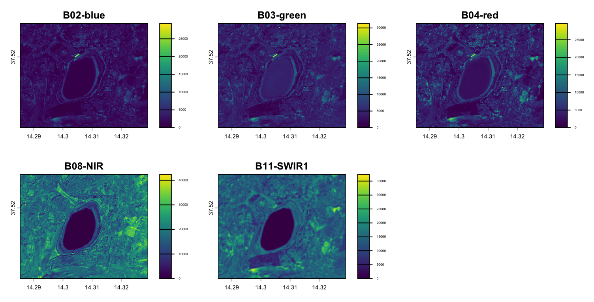
```R
#ggplot conversione dei dati del raster in un layout grafico
g2<-im.ggplot(b2)
g3<-im.ggplot(b3)
g4<-im.ggplot(b4)
g8<-im.ggplot(b8)
g11<-im.ggplot(b11)
#patchwork
(g2+g3+g4)/(g8+g11)
```
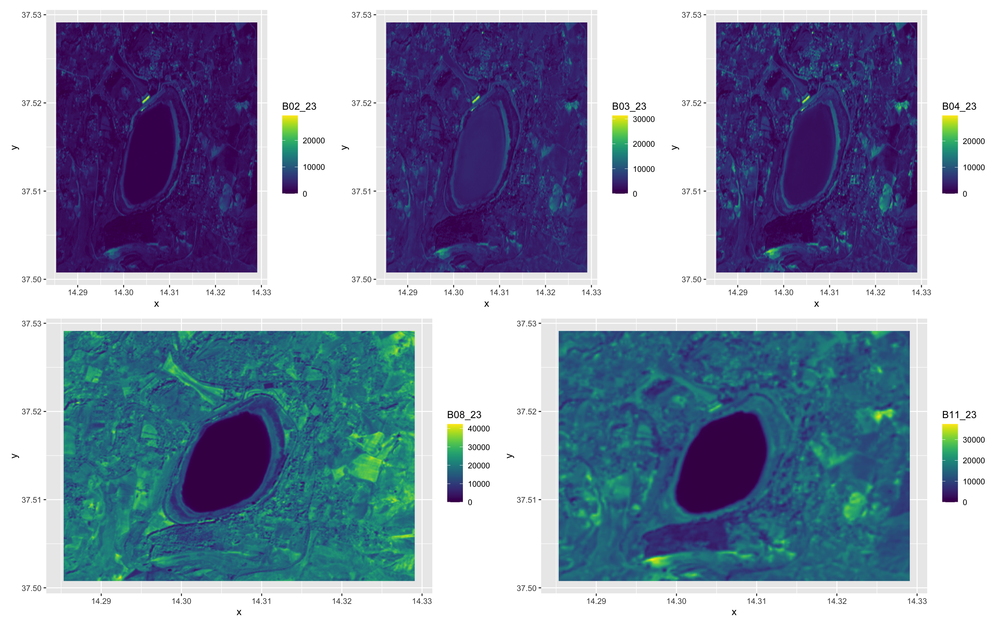
#### Dati del 2025 (crisi conclamata)
```R
#caricamento librerie
setwd("/Users/gioialoscalzo/Desktop/Lagodipergusa/2025_post")
dir()
#importazione file raster
B2<-rast("B02_25.tiff")
B3<-rast("B03_25.tiff")
B4<-rast("B04_25.tiff")
B8<-rast("B08_25.tiff")
B11<-rast("B11_25.tiff")
#visualizzazione delle bande
im.multiframe(2,3)
plot(B2, col=viridis(100), main="B02-blue", plg=list(shrink=1, cex=0.2))
plot(B3, col=viridis(100), main="B03-green", plg=list(shrink=1, cex=0.2))
plot(B4, col=viridis(100), main="B04-red", plg=list(shrink=1, cex=0.2))
plot(B8, col=viridis(100), main="B08-NIR",plg=list(shrink=1, cex=0.2))
plot(B11, col=viridis(100), main="B11-SWIR1",plg=list(shrink=1, cex=0.2))
```
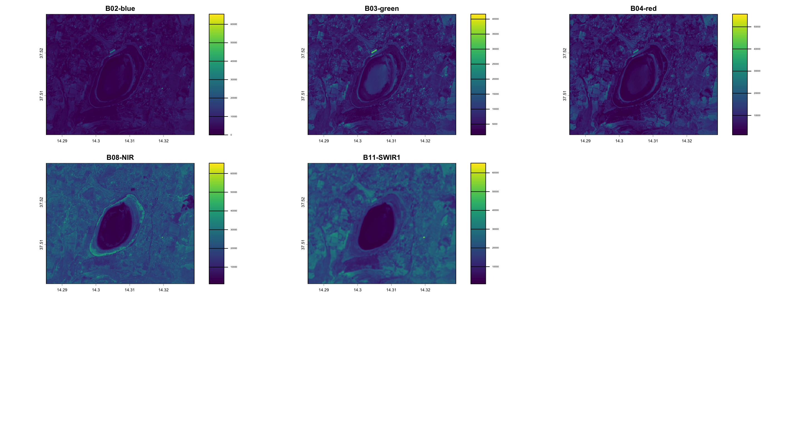
```R
#ggplot 
G2<-im.ggplot(B2)
G3<-im.ggplot(B3)
G4<-im.ggplot(B4)
G8<-im.ggplot(B8)
G11<-im.ggplot(B11)
#patchwork combinazione dei grafici ggplot in una sola figura
(G2+G3+G4)/(G8+G11)
```
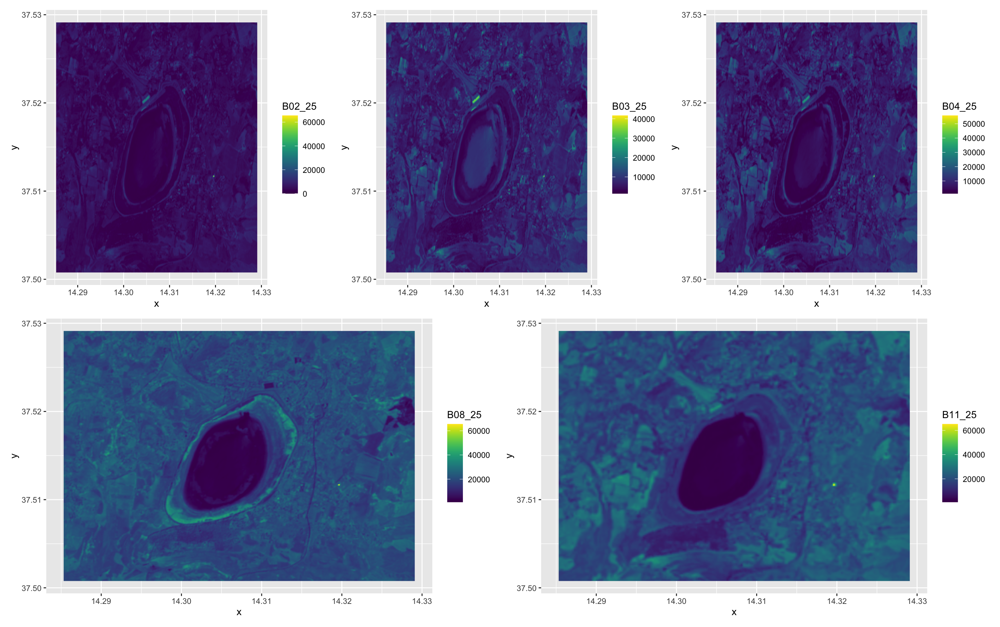

### 1.2 Composizioni RGB
Tramite la combinazione delle bande della matrice raster è possibile mettere in risalto caratteristiche fisiche differenti:
* **True color (Banda 4-Red, Banda 3-Green, Banda 2-Blue):** Riproduce la visione dell'occhio umano. 
* **False color / Infrarosso Vicino (NIR - Banda 8):** Evidenzia lo stato della vegetazione in rosso acceso e crea un fortissimo contrasto con la superficie dell'acqua.
* **False color / SWIR-NIR-Rosso:** per analisi dell'acqua e l'umidità del suolo delimitando nettamente i bordi del lago e monitora la vegetazione che apare verde brillante
#### Dati 2023
```R
im.multiframe(1,3)
#true colors visualizzazione a colori reali con funzione stretch per aumentare il contrasto visivo
plotRGB(sentinel, r=3, g=2, b=1, stretch="lin", main="Colori Reali (RGB 432) 2023")
#false colors
plotRGB(sentinel, r=4, g=3, b=2, stretch="lin", main="Falsi Colori (RGB 843) 2023")
#combinazione a falsi colori  SWIR-NIR-Rosso
plotRGB(sentinel, r=5, g=4, b=3, stretch="lin",main="Visualizzazione SWIR (Umidità del Suolo e Acqua) 2023")
```

#### Dati 2025
```R
sentinel2<-c(B2,B3,B4,B8,B11)
im.multiframe(1,3)
#true colors
plotRGB(sentinel2, r=3, g=2, b=1, stretch="lin", main="Colori Reali (RGB 432) 2025")
#false colors
plotRGB(sentinel2, r=4, g=3, b=2, stretch="lin", main="Falsi Colori (RGB 843) 2025")
#combinazione a falsi colori  SWIR-NIR-Rosso
plotRGB(sentinel2, r=5, g=4, b=3, stretch="lin",main="Visualizzazione SWIR (Umidità del Suolo e Acqua) 2025")
```


### 1.3 Confronto tra le bande
#### Dati 2023
```R
#produzione di matrice di correlazione grafica se i punti formano una retta crescente le due bande sono fortemente correlate senno le due bande portano informazioni indipendenti 
pairs(sentinel)
#ggpairs lavora su un dataframe produce grafici più chiari
library(GGally)
ggpairs(sentinel)
```
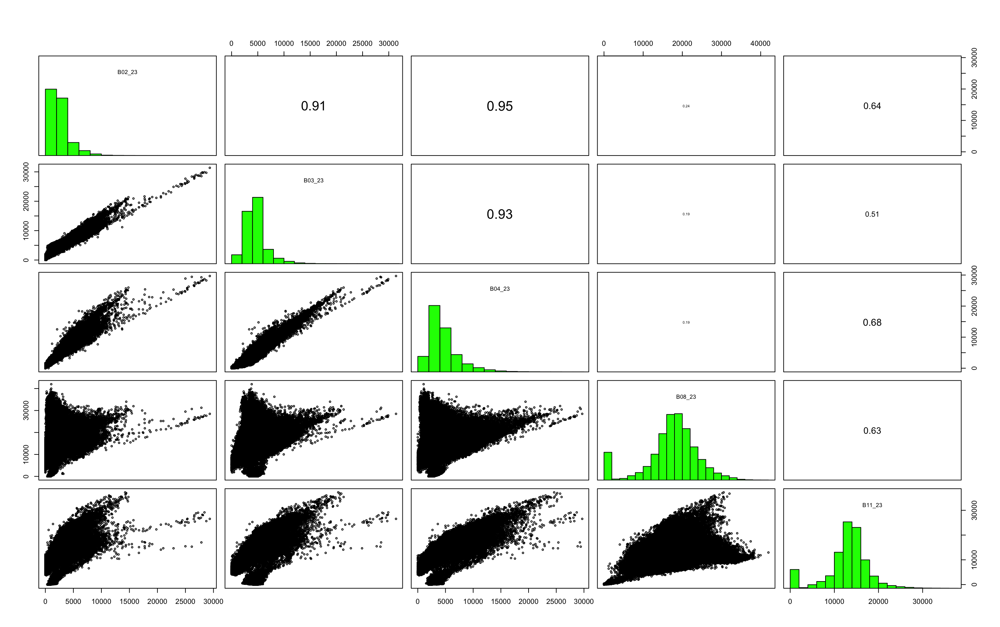


#### Dati 2025
```R
pairs(sentinel2)
library(GGally)
ggpairs(sentinel2)
```
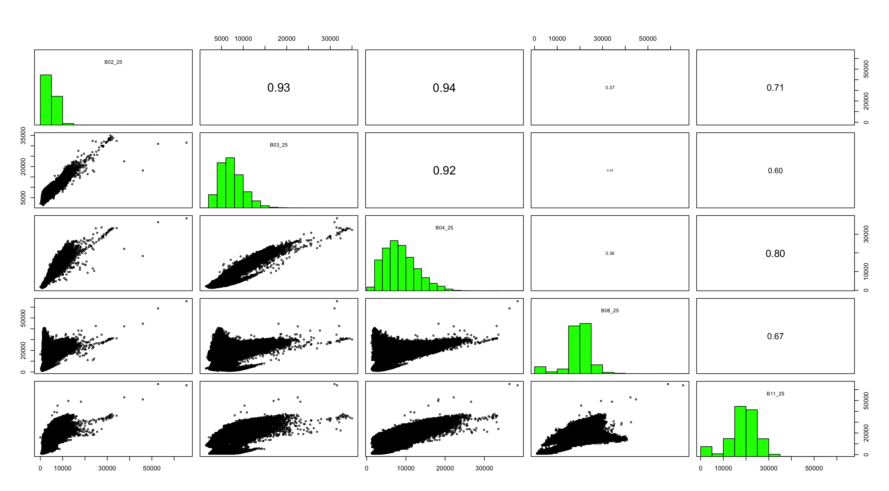

## 2. Calcolo degli indici spettrali 
### NDVI
#### 2.1 NDVI 2023
```R
im.multiframe(1,2)
ndvi2023<-(b8-b4)/(b8+b4)
tavolozza_ndvi<-colorRampPalette(c("blue", "brown", "yellow", "darkgreen"))
plot(ndvi2023, main="NDVI - Indice di Vegetazione 2023", col=tavolozza_ndvi(100),plg = list(shrink = 0.8, cex = 0.7))
hist(ndvi2023, main = "Distribuzione dei valori NDVI 2023",xlab = "Indice NDVI",ylab = "Numero di Pixel",col = "darkgreen",breaks = 50)
```
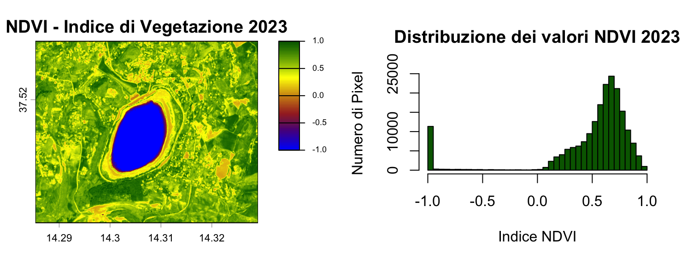
#### 2.2 NDVI 2025
L'indice spaziale più utilizzato telerilevamento
Da -1 a 0 Acqua, neve, nuvole o ombre
Da 0 a 0.2 Suolo nudo, rocce asfalto ed edili
Da 0.2 a 0.5 Vegetazione sparsa, prato, colture in fase iniziale 
Da 0.5 a 1 Vegetazione fitta, foreste e colture molto rigogliose
```R
im.multiframe(1,2)
ndvi2025<-(B8-B4)/(B8+B4)
tavolozza_ndvi<-colorRampPalette(c("blue", "brown", "yellow", "darkgreen"))
plot(ndvi2025, main="NDVI - Indice di Vegetazione 2025", col=tavolozza_ndvi(100), plg = list(shrink = 0.8, cex = 0.7))
#calcolo distribuzione
hist(ndvi2025,main = "Distribuzione dei valori NDVI 2025",xlab = "Indice NDVI",ylab = "Numero di Pixel",col = "darkgreen",breaks = 50)
```
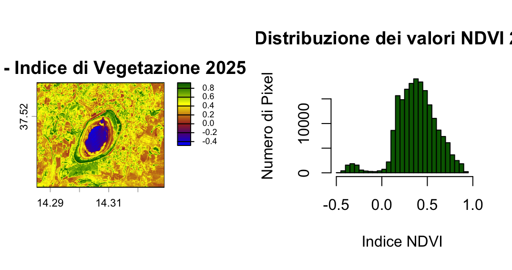
### NMDWI
Da 0.2 a 1 Acqua libera 
Da 0.0 a 0.2 Umidità elevata suolo bagnato
Sotto 0.0 suolo asciutto rocce vegetazione edifici
#### 2.3 NMDWI 2023
```R
mndwi2023<-(b3-b11)/(b3+b11)
tavolozza_mndwi2023 <- colorRampPalette(c("brown", "yellow", "cyan", "blue"))
plot(mndwi2023, main = "MNDWI - Indice Acqua Modificato 2023", col=tavolozza_mndwi2023(100))
```
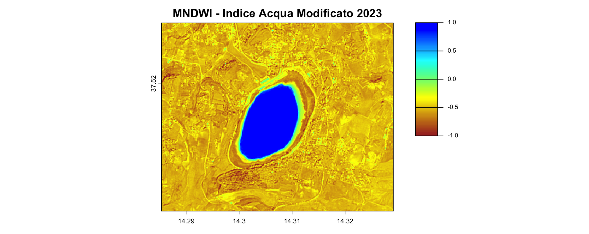
#### 2.4 NMDWI 2025
```R
mndwi2025<-(B3-B11)/(B3+B11)
tavolozza_mndwi2025 <- colorRampPalette(c("brown", "yellow", "cyan", "blue"))
plot(mndwi2025, main = "MNDWI - Indice Acqua Modificato 2025", col=tavolozza_mndwi2023(100))
```
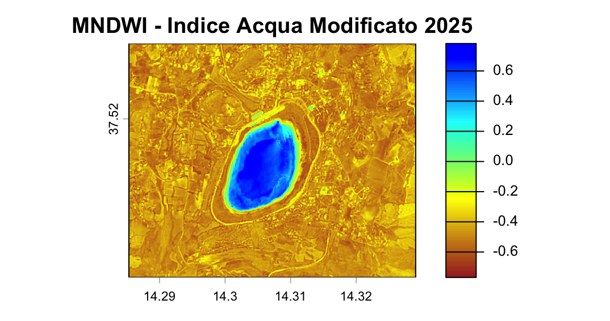

## 3. Estratto specchio d'acqua e calcolo dell'area del lago
### 3.1 2023
```R
#estratto specchio d'acqua 2023 applicazione if else su ogni pixel imposto come condizione logica i valori di mndwi2023 maggiori di 0 e restituisce il valore 1 se la condizione è vera mentre NA se è falsa
acqua_maschera <- ifel(mndwi2023 > 0, 1, NA)
plot(acqua_maschera,main = "Specchio d'Acqua Estratto (MNDWI > 0)2023",col = "blue")
```
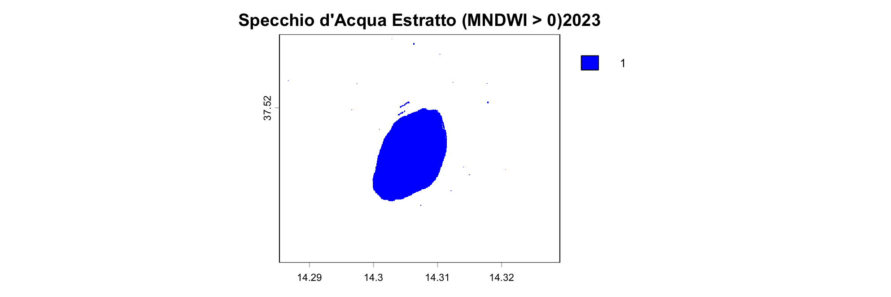
```R
#area del lago 2023
#calcolo area geografica reale coperta dai pixel
area_info <- expanse(acqua_maschera, unit = "m")
#estrae il valore numerico dell'area dalla tabella creata da expanse
area_mq <- area_info$area
#conversione im ettari e chilometri quadrati
area_ettari <- area_mq / 10000
area_km2 <- area_mq / 1000000
#formattazione e stampa del testo
cat("Area dello specchio d'acqua:\n")
cat("- Metri quadri (m²):", round(area_mq, 2), "\n")
cat("- Ettari (ha):", round(area_ettari, 2), "\n")
cat("- Km quadrati (km²):", round(area_km2, 4), "\n")
```
Area dello specchio d'acqua nel 2023 :Metri quadri (m²): 950202.1;Ettari (ha): 95.02;Km quadrati (km²): 0.9502 

### 3.2 2025
```R
#estratto specchio d'acqua 2023
acqua_maschera2 <- ifel(mndwi2025 > 0, 1, NA)
plot(acqua_maschera2,main = "Specchio d'Acqua Estratto (MNDWI > 0) 2025",col = "blue")
```
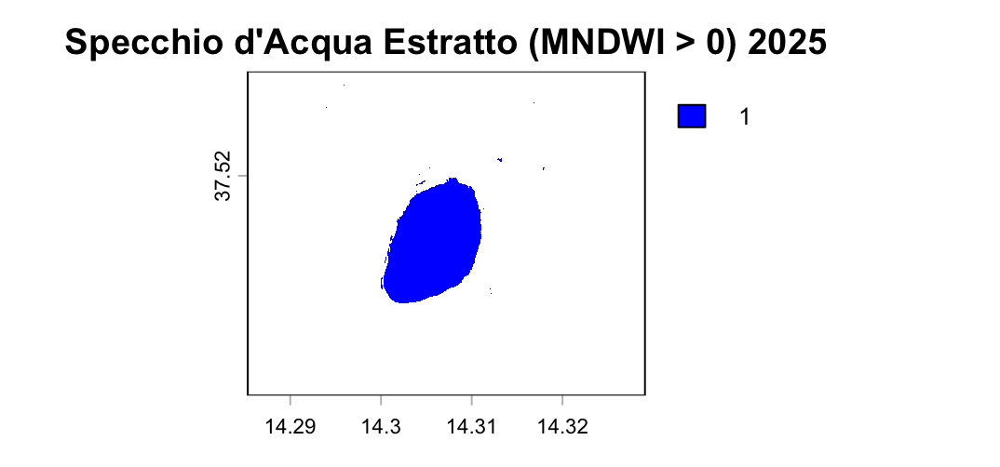
```R
#calcolo area del lago 2025
area_info <- expanse(acqua_maschera, unit = "m")
area_mq <- area_info$area
area_ettari <- area_mq / 10000
area_km2 <- area_mq / 1000000
cat("Area dello specchio d'acqua:\n")
cat("- Metri quadri (m²):", round(area_mq, 2), "\n")
cat("- Ettari (ha):", round(area_ettari, 2), "\n")
```
Area dello specchio d'acqua nel 2023 :Metri quadri (m²): 838040.4 ;Ettari (ha): 83.8;Km quadrati (km²): 0.838 

## 4.Analisi comparativa
### 4.1 variazione dell'NDVI 2023-25
```R
ndvi2023_allineato<-resample(ndvi2023, ndvi2025)
ndvi_diff<-ndvi2025-ndvi2023_allineato
tavolozza_diff<- colorRampPalette(c("red", "yellow", "white", "lightgreen", "darkgreen"))
plot(ndvi_diff,main = "Variazione dell'NDVI dal 2023 al 2025",col = tavolozza_diff(100))
```
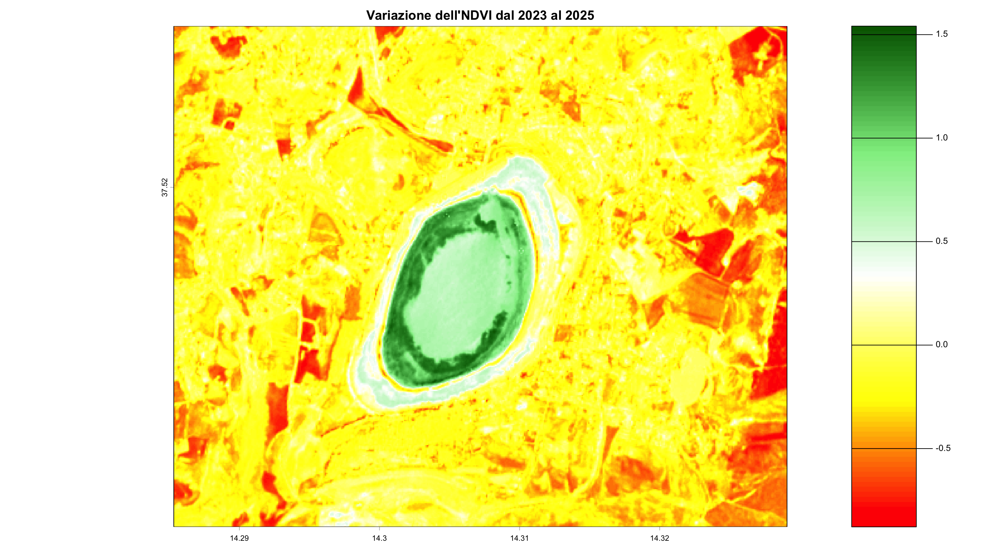
### 4.2 variazione dell'MNDVI 2023-25
```R
mndwi2023_allineato<-resample(mndwi2023, mndwi2025)
mndwi_diff<-mndwi2025-mndwi2023_allineato
plot(mndwi_diff,main = "Variazione dell'MNDWI dal 2023 al 2025",col = tavolozza_diff(100))
```
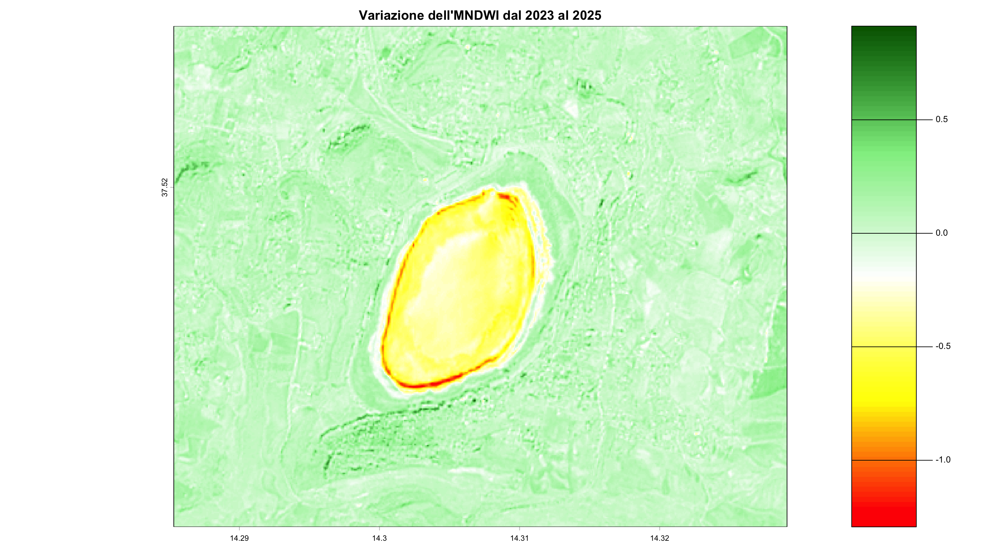

## 5. Conclusioni
L'analisi  spazio-temporale condotta tramite immagini satellitari Sentinel-2 ha permesso di quantificare in modo oggettivo ed efficace l'impatto della severa siccità che ha colpito il lago di Pergusa tra il 2023 e il 2025.
### Riduzione della Superficie Idrica:
L'applicazione dell'Indice MNDWI e successiva estrazione geodesica evidenziano una contrazione dello specchio d'acqua da 95.02 ha(2023) a 83.80 ha(2025) corrispondente a una perdita netta di 11.22 ettari di superficie lacustra.
### Risposta della Vegetazione:
La mappa differenziale dell'NDVI evidenziare variazioni marcate nella copertura vegetale ripariale ed emersa lungo i bordi del lago legate all'arretrtamento della linea di riva e all'esposizione del fondale
### Efficacia del Telerilevamento in R:
L'uso combinato dei pacchetti **`terra`** e **`imageRy`** dimostra l'utilità degli indici multispettrali per il monitoraggio continuo dei bacini endoreici e la gestione delle emergenze ambientali legate ai cambiamenti climatici.


